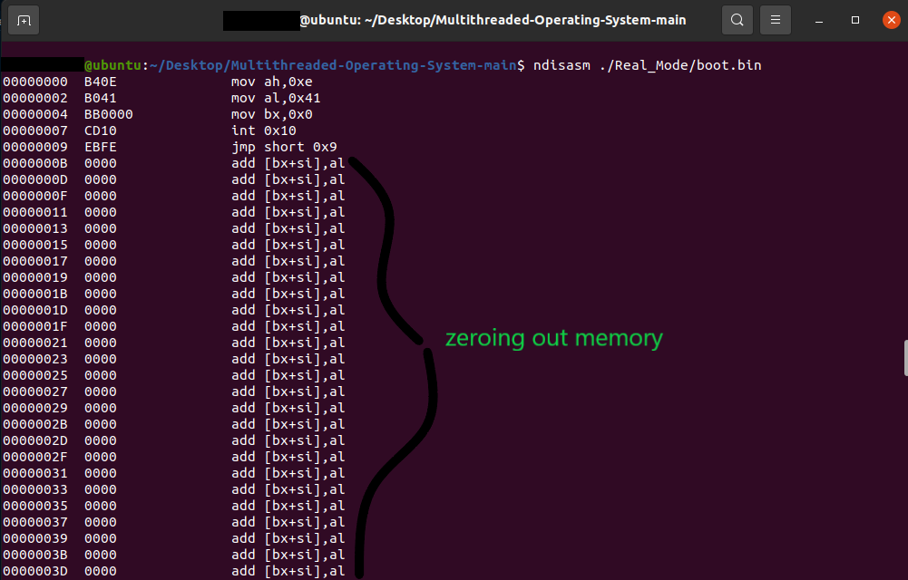
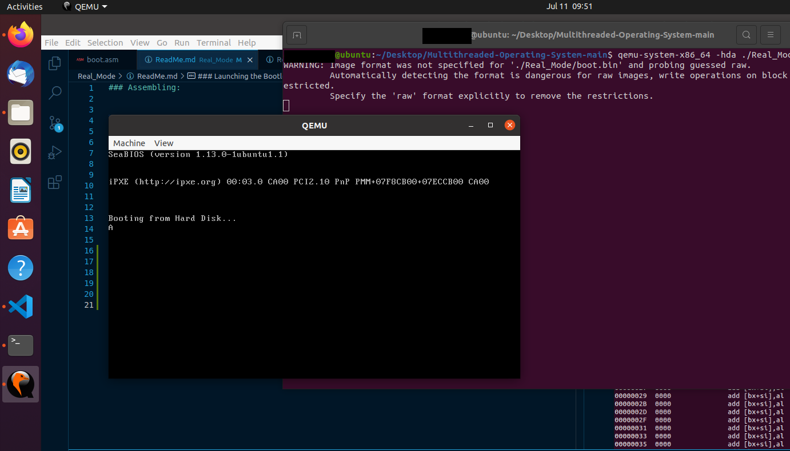

### Assembling:


```shell
$ nasm -f bin ./Real_Mode/boot.asm -o ./Real_Mode/boot.bin
```

### Disassembling:

```shell
# See the Disassembly output
$ ndisasm ./Real_Mode/boot.bin
```



### Launching the Bootloader:

```shell
$ qemu-system-x86_64 -hda ./Real_Mode/boot.bin
```
